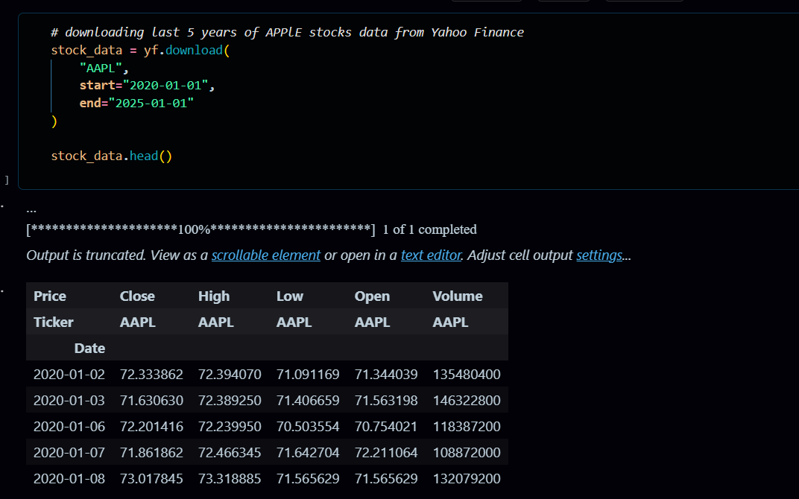
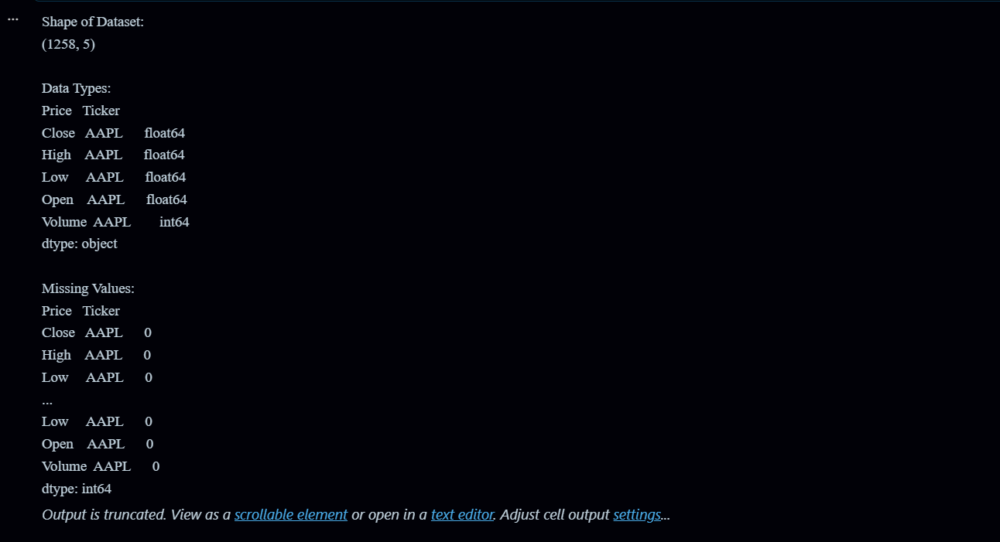
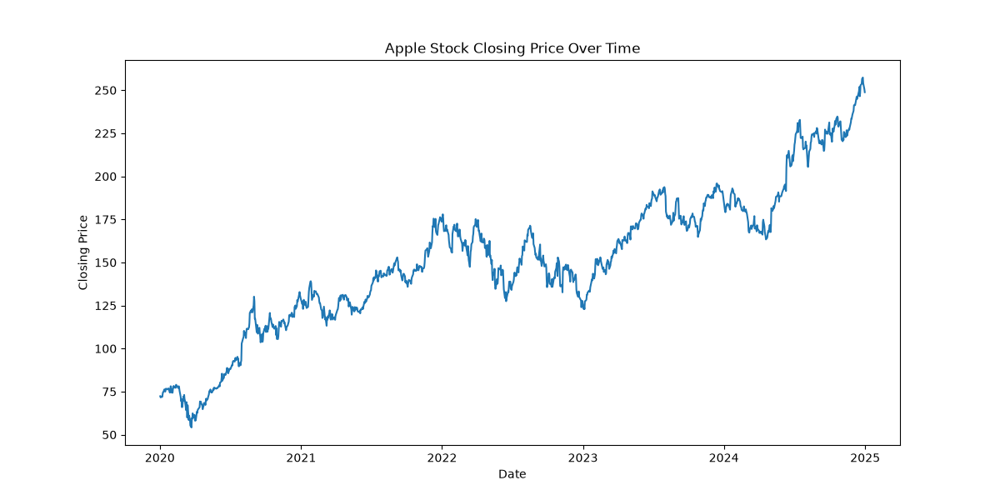
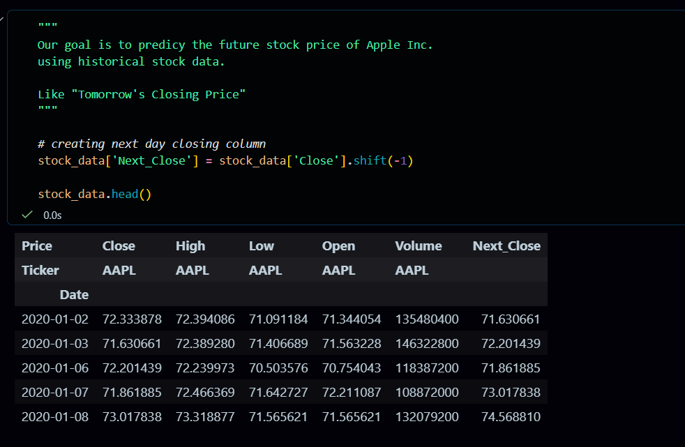
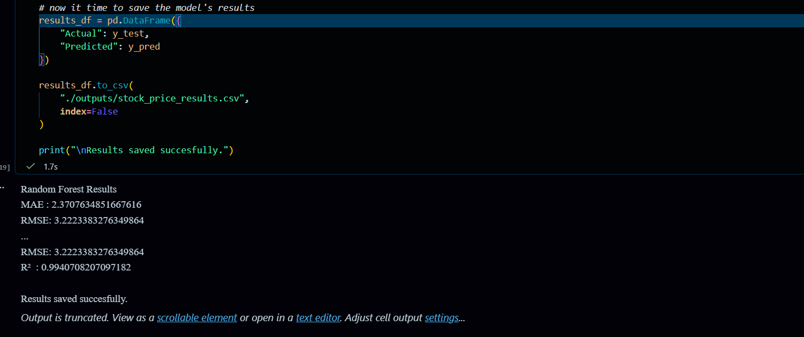
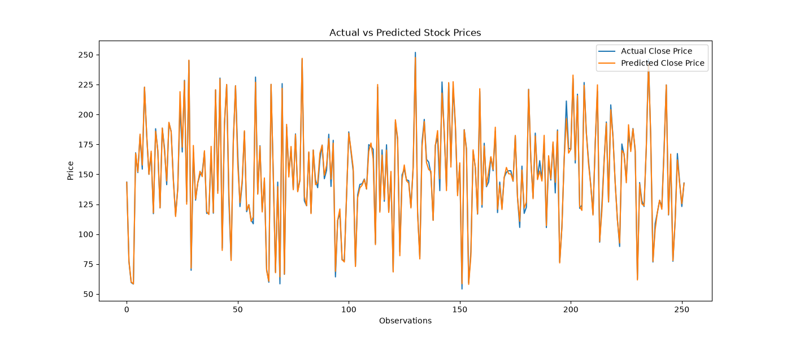
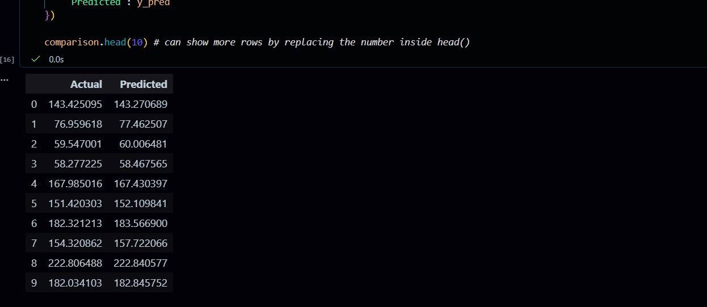

# 📈 Stock Price Prediction Using Machine Learning

Predicting the Next Day's Closing Stock Price Using Historical Market Data from Yahoo Finance

---

## 📌 Project Overview

Stock prices are influenced by a variety of factors including market trends, investor sentiment, company performance, and economic conditions. Analyzing historical stock data can help uncover patterns that may be useful for forecasting future prices.

In this project, historical stock data for **Apple Inc. (AAPL)** is collected from **Yahoo Finance** using the `yfinance` Python library. The collected data is then used to train a Machine Learning model capable of predicting the **next day's closing stock price**.

The project demonstrates a complete machine learning workflow including:

- Data Collection
- Data Exploration
- Data Cleaning
- Feature Engineering
- Regression Modeling
- Model Evaluation
- Data Visualization

The entire implementation is completed in **Jupyter Notebook** using Python.

---

# 🎯 Project Objective

The objective of this project is to predict the **next day's closing stock price** based on historical stock market data.

The model uses the following stock market features:

- Open Price
- High Price
- Low Price
- Volume

to predict:

- Next Day Closing Price

This is a **Supervised Machine Learning Regression Problem** because the target variable is a continuous numerical value.

---

# 📊 Dataset Information

## Dataset Source

The dataset is fetched directly from Yahoo Finance using the `yfinance` API.

### Stock Selected

```python
AAPL (Apple Inc.)
```

### Download Method

```python
import yfinance as yf

stock_data = yf.download(
    "AAPL",
    start="2020-01-01",
    end="2025-01-01"
)
```

---

## Dataset Features

| Column | Description |
|----------|-------------|
| Open | Opening stock price |
| High | Highest stock price during the day |
| Low | Lowest stock price during the day |
| Close | Closing stock price |
| Adj Close | Adjusted closing price |
| Volume | Number of shares traded |

---

## Target Variable

A new column called **Next_Close** is created by shifting the Close column upward by one day.

Example:

| Current Close | Next_Close |
|--------------|------------|
| 180.50 | 181.75 |
| 181.75 | 183.20 |
| 183.20 | 182.10 |

This allows the model to learn how today's market activity influences tomorrow's closing price.

---

# 🛠 Technologies Used

## Programming Language

- Python 3.x

## Development Environment

- Jupyter Notebook

## Libraries

- Pandas
- NumPy
- Matplotlib
- Scikit-Learn
- yFinance

---

# 📁 Project Structure

```text
task2-predict-future-stock/
│
├── data/
│   └── apple_stock_data.csv
│
├── images/
│   ├── actual_vs_predicted_stock_prices.png
│   └── apple_stock_closing_price.png
│
├── outputs/
│   └── stock_price_results.csv
│
├── screenshots/
│   ├── actual_closing_price_vs_predicted.png
│   ├── downloading-dataset-image.png
│   ├── MAE_RMSE.png
│   ├── next_day_closing_column.png
│   └── shape-datatype-missingvalues.png
│
├── stock_price_prediction.ipynb
│
└── README.md
```

---

# 🚀 Project Workflow

The project follows a structured Machine Learning pipeline.

---

## Step 1: Import Required Libraries

The first step is importing all necessary libraries for:

- Data handling
- Data visualization
- Machine Learning
- Yahoo Finance data collection

Libraries used:

```python
import pandas as pd
import numpy as np
import matplotlib.pyplot as plt
import yfinance as yf

from sklearn.model_selection import train_test_split
from sklearn.linear_model import LinearRegression
from sklearn.metrics import (
    mean_absolute_error,
    mean_squared_error,
    r2_score
)
```

---

## Step 2: Download Historical Stock Data

Historical stock data is downloaded directly from Yahoo Finance using the yfinance library.

### Screenshot

Dataset Download Process:



---

## Step 3: Save Dataset

The downloaded data is stored inside:

```text
data/apple_stock_data.csv
```

This allows the dataset to be reused without downloading it again.

---

## Step 4: Explore the Dataset

Before building the model, the dataset is explored to understand:

- Number of rows
- Number of columns
- Data types
- Missing values

### Screenshot

Dataset Shape, Data Types and Missing Values:



Typical checks include:

```python
stock_data.shape
stock_data.info()
stock_data.isnull().sum()
```

---

## Step 5: Visualize Stock Closing Price

The closing stock price is plotted to understand the trend over time.

### Output Graph



This visualization helps identify:

- Long-term growth trends
- Market volatility
- Price fluctuations

---

## Step 6: Feature Engineering

To predict future stock prices, a new target column is created:

```python
stock_data["Next_Close"] = stock_data["Close"].shift(-1)
```

This shifts the closing price by one day.

### Screenshot

Next Day Closing Price Column:



The final row is removed because it does not contain a future closing price.

---

## Step 7: Feature Selection

The following features are selected as model inputs:

```python
X = stock_data[
    ["Open", "High", "Low", "Volume"]
]
```

Target variable:

```python
y = stock_data["Next_Close"]
```

---

## Step 8: Split Dataset

The dataset is divided into:

| Dataset | Percentage |
|----------|------------|
| Training Data | 80% |
| Testing Data | 20% |

Example:

```python
X_train, X_test, y_train, y_test = train_test_split(
    X,
    y,
    test_size=0.2,
    random_state=42
)
```

The training data teaches the model while the testing data evaluates its performance.

---

## Step 9: Train Machine Learning Model

### Model Used

Linear Regression

The model learns relationships between:

- Open Price
- High Price
- Low Price
- Volume

and predicts:

- Next Day Closing Price

Example:

```python
model = LinearRegression()

model.fit(X_train, y_train)
```

---

## Step 10: Generate Predictions

After training, the model predicts stock prices on unseen testing data.

```python
y_pred = model.predict(X_test)
```

---

## Step 11: Evaluate Model Performance

The model is evaluated using:

### Mean Absolute Error (MAE)

Measures average prediction error.

### Root Mean Squared Error (RMSE)

Measures overall prediction accuracy.

### R² Score

Measures how well the model explains stock price variations.

Example:

```python
mae = mean_absolute_error(y_test, y_pred)

rmse = np.sqrt(
    mean_squared_error(y_test, y_pred)
)

r2 = r2_score(y_test, y_pred)
```

### Screenshot

Model Evaluation Metrics:



---

## Step 12: Compare Actual vs Predicted Prices

The model's predictions are compared against actual stock prices.

### Output Graph



### Screenshot

Notebook Output:



A strong overlap between both lines indicates good predictive performance.

---

## Step 13: Save Prediction Results

The final prediction results are saved as:

```text
outputs/stock_price_results.csv
```

The file contains:

- Actual Prices
- Predicted Prices

This allows future analysis and reporting.

---

# 📈 Results

The trained Linear Regression model successfully learned patterns from historical Apple stock data and generated predictions for future closing prices.

Evaluation metrics demonstrated the model's effectiveness in forecasting stock prices based on historical market indicators.

The Actual vs Predicted graph showed that the model was able to follow overall market trends reasonably well.

---

# 📂 Project Outputs

## Dataset

```text
data/apple_stock_data.csv
```

## Closing Price Visualization

```text
images/apple_stock_closing_price.png
```

## Prediction Comparison Graph

```text
images/actual_vs_predicted_stock_prices.png
```

## Prediction Results

```text
outputs/stock_price_results.csv
```

---

# 🧠 Skills Demonstrated

This project demonstrates practical knowledge of:

### Data Collection

- Fetching stock data using APIs

### Data Analysis

- Understanding financial datasets

### Feature Engineering

- Creating future prediction targets

### Machine Learning

- Regression modeling

### Model Evaluation

- MAE
- RMSE
- R² Score

### Data Visualization

- Trend analysis
- Prediction comparison

### Jupyter Notebook Development

- End-to-end machine learning workflow

---

# 🔮 Future Improvements

Several enhancements can improve prediction accuracy:

### Additional Features

Add technical indicators such as:

- Moving Average (MA)
- Exponential Moving Average (EMA)
- RSI
- MACD
- Bollinger Bands

### Advanced Machine Learning Models

Experiment with:

- Random Forest Regressor
- XGBoost
- LightGBM
- CatBoost

### Deep Learning Models

For more advanced forecasting:

- LSTM Networks
- GRU Networks
- Transformer Models

### Real-Time Dashboard

Deploy predictions using:

- Streamlit
- Flask
- Dash

---

# 🎓 Learning Outcomes

By completing this project, the following concepts were learned:

✔ Fetching real-world financial data using APIs

✔ Working with time-series datasets

✔ Data preprocessing and cleaning

✔ Feature engineering

✔ Regression modeling

✔ Model evaluation techniques

✔ Data visualization and interpretation

✔ End-to-end Machine Learning project development

---

# 🏁 Conclusion

This project successfully demonstrates how Machine Learning can be used to predict future stock prices using historical market data from Yahoo Finance.

Historical Apple stock data was collected, analyzed, and used to train a Linear Regression model capable of predicting the next day's closing price. The project covers the complete data science workflow from data collection and preprocessing to model evaluation and visualization.

The implementation provides a strong foundation for understanding financial forecasting and can be extended further using advanced machine learning and deep learning techniques.